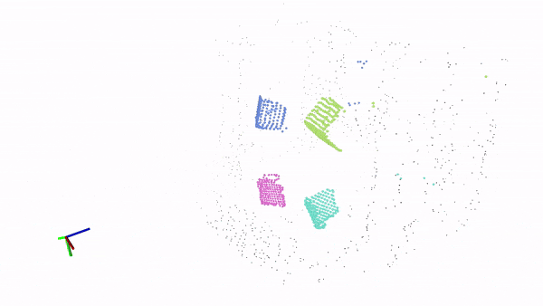
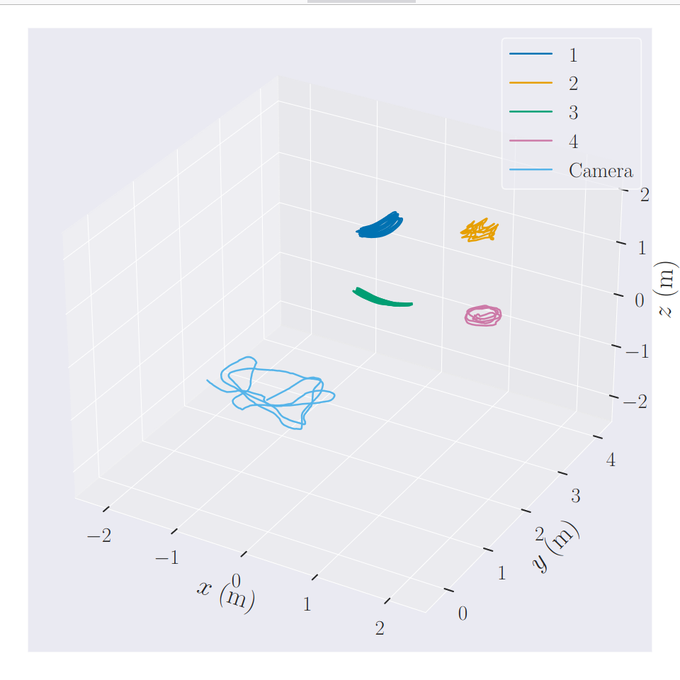
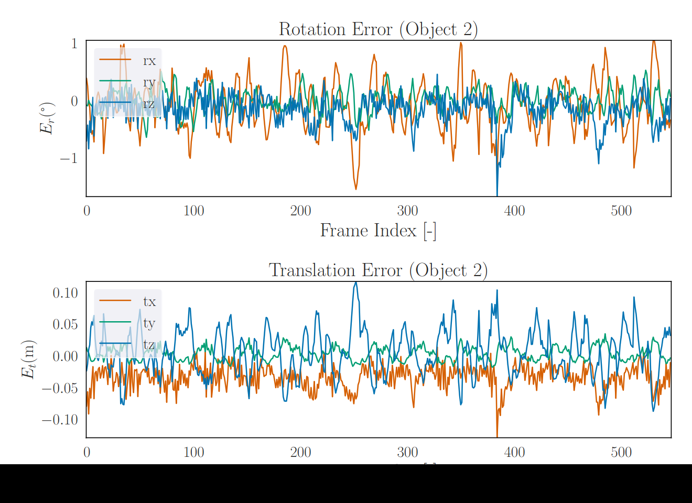
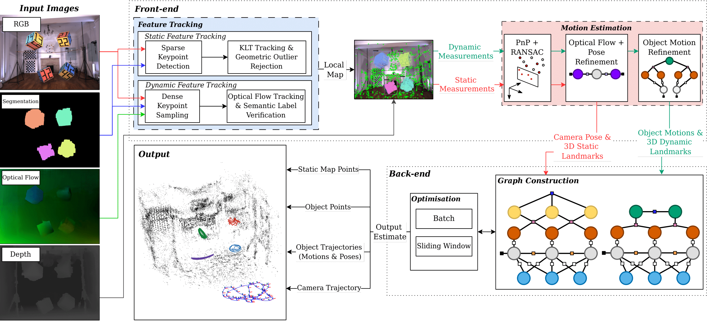

<div align="center">
  <a href="https://robotics.sydney.edu.au/our-research/robotic-perception/">
    
  </a>
</div>


# DynoSAM: Dynamic Object Smoothing and Mapping for Dynamic SLAM

DynoSAM is a Stereo/RGB-D Visual Odometry pipeline for Dynamic SLAM and estiamtes camera poses, object motions/poses as well as static background and temporal dynamic object maps.

DynoSAM current provides full-batch and sliding-window optimisation procedures and is integrated with ROS2.

## Publication
The offical code used for our paper:
- [Jesse Morris](https://jessemorris.github.io/), Yiduo Wang, Mikolaj Kliniewski, Viorela Ila, [*DynoSAM: Open-Source Smoothing and Mapping Framework for Dynamic SLAM*](https://arxiv.org/pdf/2501.11893), Arxiv.  Submitted Transactions on Robotics (T-RO) Visual SLAM Special Issue (2025).

We kindly ask to cite our paper if you find this work useful:

```bibtex

@misc{morris2025dynosam,
      title={DynoSAM: Open-Source Smoothing and Mapping Framework for Dynamic SLAM},
      author={Jesse Morris and Yiduo Wang and Mikolaj Kliniewski and Viorela Ila},
      year={2025},
      eprint={2501.11893},
      archivePrefix={arXiv},
      primaryClass={cs.RO},
      url={https://arxiv.org/abs/2501.11893},
}

```
## Related Publications

DynoSAM was build as a culmination of several works:

- J. Morris, Y. Wang, V. Ila.  [**The Importance of Coordinate Frames in Dynamic SLAM**](https://acfr-rpg.github.io/dynamic_slam_coordinates/). IEEE Intl. Conf. on Robotics and Automation (ICRA), 2024
- J. Zhang, M. Henein, R. Mahony, V. Ila [**VDO-SLAM:  A Visual Dynamic Object-aware SLAM System**](https://arxiv.org/abs/2005.11052), ArXiv
- M. Henein, J. Zhang, R. Mahony, V. Ila. [**Dynamic SLAM: The Need for Speed**](https://ieeexplore.ieee.org/abstract/document/9196895).2020 IEEE International Conference on Robotics and Automation (ICRA). IEEE, 2020.

## Demo

Example output running on the Oxford Multimotion Dataset (OMD, _swinging_4_unconstrained_).

<div align="center">
  
</div>

> NOTE: this visualisation was generated using playback and is does not reflect the realtime output of our system.

# 1. Installtion

Tested on Ubuntu 20.04


## Prerequisites
- [ROS2](https://docs.ros.org/en/humble/Installation.html)
    > NOTE: this links to the Humble distribution which used during development. Other distro's will probably work.
- [GTSAM](https://github.com/borglab/gtsam) >= 4.1
- [OpenCV](https://github.com/opencv/opencv) >= 3.4
- [OpenGV](https://github.com/MIT-SPARK/opengv)
- [Glog](http://rpg.ifi.uzh.ch/docs/glog.html), [Gflags](https://gflags.github.io/gflags/)
- [Gtest](https://github.com/google/googletest/blob/master/googletest/docs/primer.md) (installed automagically)
- [config_utilities](https://github.com/MIT-SPARK/config_utilities)
- [dynamic_slam_interfaces](https://github.com/ACFR-RPG/dynamic_slam_interfaces) (Required by default. Can be optionally made not a requirement. See Insallation instructions below)

External dependancies (for visualization) not required for compilation.
- [rviz_dynamic_slam_plugins](https://github.com/ACFR-RPG/rviz_dynamic_slam_plugins) (Plugin to display custom `dynamic_slam_interfaces` messages which are advertised by default.)


## Installation Instructions
DynoSAM is currently built within the ROS2 infrastructure (if there is enough interest I will split out each component into ROS and non-ROS modules.)

We provide a development [Dockerfile](./docker/Dockerfile) that will install all dependancies but expects DynoSAM to be cloned locally. The associated [container creation](./docker/create_container.sh) will then mount the local DynoSAM folder into the container along with local results/dataset folders.

> NOTE: there are some minor issues with the current dockerfile which will be fixed intime.

The general ROS2 build procedure holds as all relevant subfolders in DynoSAM are built as packages.

More detailed instructions are found here: [Insallation instructions](./docs/media/INSTALL.md)

```
# Finally compile
cd ros_ws && colcon build

# Refresh workspace
source ~/ros_ws/install/setup.bash
```

`dynamic_slam_interfaces` is a require dependacy by default. This package is used to include custom messages that represet the state of each dynamic object per frame and is used by the ROS publishers.

To disable this dependancy compile the code as
```
colcon build --cmake-args -DENABLE_DYNAMIC_SLAM_INTERFACES=OFF
```
By default `ENABLE_DYNAMIC_SLAM_INTERFACES=ON` in the [CMakeLists.txt](./dynosam_ros/CMakeLists.txt). This CMake option will additionally change the _visualisation_ (and the output topics) used by DynoSAM. See the [ROS Visualisation](#ros-visualisation) section below.


# 2. Usage

## Documentation
We auto generate [Doxygen code docs](https://acfr-rpg.github.io/DynOSAM/doxygen/) for all classes in DynoSAM. The code docs are up-to-date with the _main_ branch.

## Running and Configuration

DynoSAM uses a combination of yaml files and GFLAGS (these are being simplified but GFLAGS allows an easier way to programatically set variables over cmd-line) to configure the system. ROS params are used sparingly and are only used to set input file paths.

### Running with Launch files
All .yaml and .flag files should be placed in the same params folder, which is specified by the command line.
To specify the dataset loader, the GFLAG `--data_provider_type` should be set (see [pipeline.flags](./dynosam/params/pipeline.flags)). Eventually, this will also include the option to take data live from a sensor. For data providers that are specific to each dataset used for evaluation, a dataset path must also be set.

DynoSAM will also log all output configuration to an output-folder specified by `--output_path` (see [pipeline.flags](./dynosam/params/pipeline.flags)).
__Data will only be logged if this folder exists.__

The DynoSAM pipeline can be launched via launch file:
```
ros2 launch dynosam_ros dyno_sam_launch.py params_path:=<value> dataset_path:=<> v:=<>
```
The launch file will load all the GFLAG's from all .flag files found in the params folder.

### Running with complex input
For evaluation and more refined control over the input to the system we also provide an evaluation launch script and can be run as:
```
ros2 run dynosam_utils eval_launch.py
  --dataset_path <Path to dataset>
  --params_path <Absolute path to the params folder to run dynosam with>
  --launch_file <Wich dynosam launch file to run with!>
  --output_path <Specifies the output path, overwritting the one set by pipeline.flags>
  --name <Name of the experiment to run. This will be appended to the output_path file such that the ouput file path will be output_path/name>
  --run_pipeline <if present, the full visual odometry pipeline will run>
  --run_analysis <if present, the evaluation script will run using the output found in the full output path>
  *args...

```
This script automated the process of running the evaluation suite (ie. `--run_analysis_`) and set all rosparams/re-direct input and output paths (e.g. `--output_path`, `name`, etc...).

In addition to these arguments, this script takes all additional cmd-line arguments and parses them to the DynoSAM node, allowing any GFLAGS to be overwritten directly by specifying them in the commandline. e.g the dataset provider type can be specified as:
```
ros2 run dynosam_utils eval_launch.py --output_path=/path/to/results --name test --run_pipeline --data_provider_type=2
```
This script will also construct the corresponding output folder (e.g. ouput_path/name) and make it, if it does not exist. In the aboce example, the program will make the folder _'/path/to/results/test/'_ and deposit all output logs in that folder.

> NOTE: for all evaluations and metrics, this script was used to run the program.

### Running programtically
All the cmdline functionality can be replicated programtically using python in order to run experiments and evaluations.
See [run_experiments_tro.py](./dynosam_utils/src/run_experiments_tro.py) for examples.


## Tests
We use [gtest](https://github.com/google/googletest) for unit testing. This is installed automagically. When building with ROS, all tests will go into the install folder.

To run the unit tests: build the code, navigate inside the `install` folder and run the tests. Both `dynosam` and `dynosam_ros` packages come with unit tests.

We provide a useful script to make running tests easier. Run
```
ros2 run dynosam_ros run_dynosam_gtest.py
```
from anywhere on the system to run tests. The unit tests for a particular package (ie. `dynosam` and `dynosam_ros`) can be specified using the `--package` argumement. This script forwards all arguments to the test executable so that GFLAGS can still be used e.g.
```
run dynosam_ros run_dynosam_gtest.py --package=dynosam_ros --gtest_filter=TestConcepts*
```

## Datasets

We provide a number of data providers which process datasets into the input format specified by DynoSAM which includes input images for the pipeline and ground truth data for evaluation.

We are currently working on providing datasets to process live data, along-side pre-processing modules which will be available soon.

[Download](https://unisyd-my.sharepoint.com/:f:/g/personal/jesse_morris_sydney_edu_au/EhK53_rmAqRDtHslS9HEuwwByFpR2oX59A_CKQTKrc9dAA?e=nbmM8h) processed version of the KITTI tracking and OMD sequences. The other sequences were used in their raw form.

### i. KITTI Tracking Dataset
We use a modified version of the KITTI tracking dataset which includes ground truth motion data, as well dense optical-flow, depth and segmentation masks.

The required dataset loader can be specified by setting `--data_provider_type=0`

### ii. Oxford Multimotion Dataset (OMD)
Raw data can be downloaded from the [project page](https://robotic-esp.com/datasets/omd/).
For our 2024 T-RO paper we used a modified version of the dataset which can be downloaded from the above link.

C++ code to parse the raw dataset (although not used) is also provided and the code used to pre-process the dataset (as optical flow and segmentation masks are not provided in the raw dataset) will also be provided soon.

The required dataset loader can be specified by setting `--data_provider_type=3`


### iii. Cluster Dataset
Access [raw dataset](https://huangjh-pub.github.io/page/clusterslam-dataset/) and download the CARLA-* sequences. No pre-processing is needed on this dataset and the raw data can be parsed by DynoSAM directly.

The required dataset loader can be specified by setting `--data_provider_type=2`

### iv. Virtual KITTI 2
Access [raw dataset](https://europe.naverlabs.com/research/computer-vision/proxy-virtual-worlds-vkitti-2/) and extract in a folder. No pre-processing is needed on this dataset and the raw data can be parsed by DynoSAM directly.

The required dataset loader can be specified by setting `--data_provider_type=1`


## ROS Visualisation
All 3D visualisation in DynoSAM is done using RVIZ. Camera pose and point clouds are vizualised using standard ROS messages. Visualising the objects is more complex and we provide two different ways to do this which can be controlled at compile time using the cmake flag `-DENABLE_DYNAMIC_SLAM_INTERFACES=ON/OFF`

1. (`ON`, now default) Usage of the custom `dynamic_slam_interfaces::msg::ObjectOdometry` (in [dynamic_slam_interfaces](https://github.com/ACFR-RPG/dynamic_slam_interfaces)) to publish to current state of the each object per frame. Our custom RVIZ plugin [rviz_dynamic_slam_plugins](https://github.com/ACFR-RPG/rviz_dynamic_slam_plugins) can be used to visualize this message type. The object id, current pose, velocity, path etc... will be shown for each object. See this [README.md](./dynosam_ros/include/dynosam_ros/displays/dynamic_slam_displays/README.md) for more detail.
2. (`OFF`) Instead of using the custom messages, standard ROS visualisation messages are used instead to display the state of each object (object id, current pose...). This setup is therefore more complex, and results in many more advertised topics to achieve a similar (and less flexible) display than using the custom plugin/interface combination. As a result, this method of display is not preferred. See this [README.md](./dynosam_ros/include/dynosam_ros/displays/inbuilt_displays/README.md) for more detail.

> NOTE: the publishing of object states is meant primilarily for __visualisation__ purposes and not for recording data used for evaluation. This is done using csv files in a different submodule: see [Evaluation](#4-evaluation).


# 2. Image Pre-processing
DynoSAM requires input image data in the form:
- RGB
- Depth/Stereo
- Dense Optical Flow
- Dense Semantic Instance mask

and can usually be obtained by pre-processing the input RGB image.

All datasets includes already have been pre-processed to include these images.
The code used to do this preprocessing is coming soon...


# 3. Parameters

We use a two different sets of parameters for our pipeline

- YAML files: contain params for the Pipeline and Frontend and some dataset related parameters. We use the wonderful [config_utilies](https://github.com/MIT-SPARK/config_utilities) library to load these files.
- [gflag](https://gflags.github.io/gflags/) for all other params which are found in .flag files.

Structurally DynoSAM expects all params files (.yaml and .flag) to be found in the same folder. By default we use the param files in this repo but you can specify any path as long as the folder follows the required structure:

```
params_folder:
  - FrontendParams.yaml
  - PipelineParams.yaml
 [- DatasetParams.yaml ]
 [- CameraParams.yaml ]
  - *.flags
```

The [dynosam launch file](./dynosam_ros//launch/dyno_sam_launch.py) has some smarts in it so that it will search the given the folder (`params path`) for any file with the ".flags" suffix and load the specified flags.

From a design persepctive, we use gflags in addition to yaml files becuase we are able to programmatically change these params as additional arguments to the DynoSAM program. This is used extensively for automated experiments where we re-configure the pipeline for different runs.

To see all params (yaml and gflags) run the eval launch script with the gflag `--show_dyno_args=true`.

> NOTE: We have to manually print the params and there are some minor issues printing all params (e.g. we currently cannot print the camera params with the _config_utilities_ library due to the way we currently load the variables!)

To see all gflag options run:
```
ros2 run dynosam_ros dynosam_node --help
```
> NOTE: there may be some minor discrepeancies between the parameters as some values that are in the config files are then overwritten by gflag values so we can configure them easily.


## System Parameters


## Camera Parameters

Camera Parameters (ie. intrinsics) two possible sources
  - Provided by the loaded data-provider
  - Loaded from [CameraParams.yaml](./dynosam//params/CameraParams.yaml)

If the param `prefer_data_provider_camera_params` is set to True, the parameters provided by the data-loader (if available) will be used. Otherwise, the paramters from the yaml file will be used.

This allows each data-loader to specfy/loaded the camera params from the dataset itself, without having to additionally specify the intrinsics in another file.

# 4. Evaluation

## Output logs
When the DynoSAM pipeline is run it will output log files in the given output directory. The log files record the output of the state-estimation as well as various interal data.
As mentioned, the output directory is specified by `--output_path=/path/to/results` (and may be further specified using `--name` when using `eval_launch.py`).

The log files include (but are not limited to) files in the form

- __*camera_pose_log.csv__
- __*object_motion_log.csv__
- __*object_pose_log.csv__

The presence of (at least ) these three files in a folder define a "dynosam results folder", from which the provided evaluation suite can process and produce results and metrics.

Some additional statistics files will also be logged. The * specifies a module prefix (e.g. frontend, rgbd_world_backend) that is used to specify where the logged state-estimates have come from.
This is used to separate out the front-end estimation from the back-end. Each back-end formulation (ie. Motion Estimator and Pose Estimator) provides its own module name, which is used as the module prefix. An additional suffix can be added to the module name through the `--updater_suffix` gflag.

Camera Pose log files are in the form:
```
frame id, tx, ty, tz, qx, qy, qz, qw, gt_tx, gt_ty, gt_tz, gt_qx, gt_qy, gt_qz, gt_qw
```
where the transformation `T_world_camera` is reported in translation and quaternion form.

Object Pose/Motion log files log in the form:
```
frame id, object id, tx, ty, tz, qx, qy, qz, qw, gt_tx, gt_ty, gt_tz, gt_qx, gt_qy, gt_qz, gt_qw
```
In the case of motion logs, the frame id is the __to__ motion, such that the motion logged takes the object frame __from frame id - 1 to frame id__.

## Results and Metrics

The DynoSAM framework comes with automated [evaluation tools](./dynosam_utils/dynosam_utils//evaluation/) that run as part of the pipeline. This can be run with the`--run_analysis` argument when using `eval_launch.py`. The evaluation module will look for a valid dynosam results folder in the provided output directory and will run evaluations _per prefix found_ in the folder. This enables one folder to contain multiple sets of log files, each defined with a different prefix, i.e for one dataset, multiple configurations of the back-end can be run and logged to the same folder, as long as the prefix is different.

From the logged files the evaluation suite will produce ATE and RPE results for visual odometry and AME, RME and RPE results for objects. See our TRO paper for more details on these metrics. Per-frame numerical errors are logged in __*results.pdf__ with error plots for each metric as well as plots of the object and camera trajectory additionally included.

> Two examples of our automated result generation are shown below
<table>
  <tr>
    <td></td>
    <td></td>
  </tr>
</table>

A full summary of numerical results are also generated in __result_tables.pdf__. This file includes all metrics for all sets of dynosam results found. The per-object error (for each metric) is recorded, as is the mean error over all objects for a particular metric.

The `DatasetEvaluator` does most of the heavy lifting and can be found in the [evaluation_lib.py](./dynosam_utils/dynosam_utils/evaluation/evaluation_lib.py) module. As shown in some of the other evaluation scripts (e.g [sliding_window_vs_batch_error_plot.py](./dynosam_utils/src/sliding_window_vs_batch_error_plot.py)) we can use the tools and classes defined to do more complex evaluation and visualisation.

# 5. Program Structure and Modules


<div align="center">
  
</div>


We follow a similar module/pipeline structure as developed in [Kimera](https://github.com/MIT-SPARK/Kimera-VIO) and I would like to thank the authors for their wondeful open-source code that has given me much inspiration.

Where possible, I have streamlined their 'Modular Pipelining'; each high-level component (effectively the data-provider, front-end, back-end and visualiser) is defined by a [Pipeline](./dynosam/include/dynosam/pipeline/PipelineBase.hpp) and a [Module](./dynosam/include/dynosam/common/ModuleBase.hpp).


A Pipeline is a connecting class, derived from `PipelineBase`, is responsible for controlling the movement and transformation of data too and from modules. In most cases, this involves some data-packet that is produced as the output of another module and sending through the pipeline. This is achieved by connecting a [`ThreadSafeQueue`](./dynosam/include/dynosam/pipeline/ThreadSafeQueue.hpp) to the input and output of a pipeline. Each pipeline has an associated module which actually does the processing on the input data and produced some output data, which is then sent along the connected ouput queue to any connecting modules.


## References to our TRO Paper
How many times have you read a research paper and then gone to the code only to have absolutely no idea how the implementation connects to the theory/discussion?

Too many in my experience.

### Notation

The notation from our paper has the following implementation:

- $k$ (used as discrete time-step) is denoted with `FrameId` in the code.
  > NOTE: $k$ is treated as a 'time-step' but in the code this is assocaited with a frame number (an integer value from 0... N). We also have assocaited `Timestamp` information associated with each frame but this is not actually used.
- $i$ (used as unique tracking id) is denoted as `TrackletId` in the code.
- $j$ (used as unique object id) is denoted as `ObjectId` in the code.

All transform types (e.g. poses $X$ and motions $H$) are implemented using `gtsam::Pose3` and measurement types (e.g. 3D landmarks/points and 2D Features) are `Eigen::Vectors` as implemented through gtsam.

> NOTE: I was very inconsistent with my variable naming through this code, mainly becuase I did not find a good way to deal with the funky three-indexed notation very well. I am fixing this as I go ;)

### Modules
The front-end and back-ends are implemented in associated subfolders.


__Front-end__

- Main feature tracker defined in [FeatureTracker.hpp](./dynosam/include/dynosam/frontend/vision/FeatureTracker.hpp) although the implementation is spread across a few impl and .cc files.

- Motion Estimation modules (PnP + RANSAC and the two refinement steps) are all defined in [MotionSolver.hpp](./dynosam/include/dynosam/frontend/vision/MotionSolver.hpp).

__Back-end__

As per our key contributions, our back-end is structured to facilitate new implementations for Dynamic SLAM systems. This is achieved through two key classes

- [`Formulation`](./dynosam/include/dynosam/backend/Formulation.hpp) base class which acts as the foundational structure for building and managin factor graphs in Dynamic SLAM.
  - It is reponsible for Constructs factor graphs with initial values.
  - Manages the high-level bookkeeping for when points and objects are added.
  - Integrates new observations into the graph and updates it accordingly.
  - It creates an `Acccessor` object which is used externally to extract and interact with the internal representation.

- [`Accessor`](./dynosam/include/dynosam/backend/Accessor.hpp) defines the interface between the derived `Formulation` and the backend modules and facilitates the extraction and conversion of variables into a format that aligns with backend expectations. This format is specified in our paper as $\mathcal{O}_k$.

Each formulation will need to derive from `Formulation` and define their own `Accessor`. The two formulations discussed in our paper are implemented as
  - [`WorldMotionFormulation`](./dynosam/include/dynosam/backend/rgbd/WorldMotionEstimator.hpp)
  - [`WorldPoseFormulation`](./dynosam/include/dynosam/backend/rgbd/WorldPoseEstimator.hpp)


# 6. Contribution Guidelines

We strongly encourage you to submit issues, feedback and potential improvements.
We follow the branch, open PR, review, and merge workflow.

As of Nov 2024 I am still actively developing this project as part of my PhD at the [ACFR](https://www.sydney.edu.au/engineering/our-research/robotics-and-intelligent-systems/australian-centre-for-robotics.html). Things may change but I will do my best to ensure versions are tagged etc... as a result I will also be happy to address all bugs and feature requests! Send 'em through!!

To contribute to this repo, make sure you have [pre-commit](https://pre-commit.com/) installed to enable checks.
```bash
pip install pre-commit
```

We provide a pre-commit configuration so just ensure you have the git hooks setup:

```bash
pre-commit install
```

We also provide a `.clang-format` file with the style rules that the repo uses, so that you can use [`clang-format`](https://clang.llvm.org/docs/ClangFormat.html) to reformat your code.


# 7. BSD License

The DynoSAM framework is open-sourced under the BSD License, see [LICENSE](./LICENSE).
